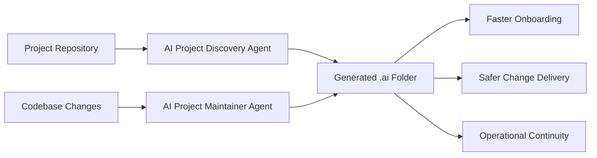

# dept-agentic-standards

`dept-agentic-standards` is the baseline framework for making DEPT Managed Services projects AI-ready from day one.

It provides:
- standards for what a project must document for reliable AI assistance;
- reusable agent instructions for rapid repository discovery;
- templates for generating consistent `.ai` project context;
- prompts and examples for repeatable adoption.

## Vision for Agentic Managed Services

Managed Services teams should be able to onboard an AI agent into any project in hours, not weeks. This repository defines the minimum operational, architectural, and governance context required for that outcome.



## How the Agents Work

### AI Project Discovery Agent

The agent in `.github/agents/ai-project-discovery-agent.agent.md` is a fully executable VS Code agent. Select it from the agent picker in Copilot Chat and it will:
1. Map system architecture and runtime boundaries.
2. Extract dependencies and integration surface.
3. Identify deployment, CMS, monitoring, and coding standards.
4. Produce a complete `.ai` folder.
5. Flag assumptions and unresolved gaps for human validation.

### AI Project Maintainer Agent

The agent in `.github/agents/ai-project-maintainer-agent.agent.md` keeps the `.ai` folder current as the project evolves:
1. Detects what has changed since the last `.ai` update using git history and file evidence.
2. Assesses staleness severity per file (critical / moderate / minor / current).
3. Applies targeted updates to affected sections only — correct content is preserved.
4. Captures new unknowns as validation questions.
5. Produces a change summary with a clear record of what was updated and why.

Run the Maintainer Agent after each sprint, release, infrastructure change, or incident postmortem.

> Full agent logic documentation is in `agents/` for reference. The executable `.agent.md` files in `.github/agents/` are what VS Code and Copilot load at runtime.

## How to Bootstrap a New Project

### Step 1 — Copy agents, prompt, and templates into the project

```bash
cp -r .github/agents/ /path/to/your-project/.github/agents/
cp -r .github/prompts/ /path/to/your-project/.github/prompts/
cp -r templates/ /path/to/your-project/.ai/
```

The Discovery Agent will automatically generate AI wiring files during bootstrap:
- `.github/copilot-instructions.md` — loaded by GitHub Copilot in every session
- `CLAUDE.md` — loaded by Claude Code automatically
- `.github/instructions/ai-context.instructions.md` — loaded by Copilot for every file

These files tell the AI to read `.ai/` before answering any questions about the project.

### Step 2 — Run the Discovery Agent

In GitHub Copilot Chat, select **AI Project Discovery Agent** from the agent picker, then send:

```
Bootstrap this project's .ai folder
```

Or run the slash command `/bootstrap-project-context`. The agent reads the repository and generates all nine `.ai` files automatically.

### Step 3 — Review and approve

1. Review all generated `.ai` files.
2. Resolve `Validation Questions` — gaps the agent could not verify from code alone.
3. Commit `.ai/` to a feature branch and open a PR for team review.
4. Merge when approved.

### Step 4 — Keep it current

After each sprint or release, select the **AI Project Maintainer Agent** in Copilot Chat and run it. It detects what changed and updates only the affected sections.

## Future Roadmap

Roadmap details are in `docs/roadmap.md`. In short:
- establish and harden the project standard;
- operationalize discovery automation;
- scale AI-ready managed services delivery;
- expand into specialized service agents;
- package as a commercial Agentic Managed Services offering.
