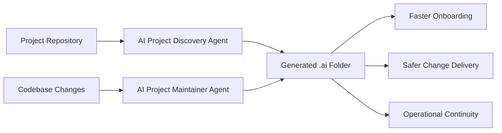

# dept-agentic-standards

`dept-agentic-standards` is the baseline framework for making DEPT Managed Services projects AI-ready from day one.

It provides:
- standards for what a project must document for reliable AI assistance;
- reusable agent instructions for rapid repository discovery;
- templates for generating consistent `.ai` project context;
- prompts and examples for repeatable adoption.

## Vision for Agentic Managed Services

Managed Services teams should be able to onboard an AI agent into any project in hours, not weeks. This repository defines the minimum operational, architectural, and governance context required for that outcome.

## How the Agents Work

### AI Project Discovery Agent

The agent in `agents/ai-project-discovery-agent.md` performs a structured pass over a repository and delivery environment:
1. Maps system architecture and runtime boundaries.
2. Extracts dependencies and integration surface.
3. Identifies deployment, CMS, monitoring, and coding standards.
4. Produces a complete `.ai` folder using the templates in `templates/`.
5. Flags assumptions and unresolved gaps for human validation.

### AI Project Maintainer Agent

The agent in `agents/ai-project-maintainer-agent.md` keeps the `.ai` folder current as the project evolves:
1. Detects what has changed since the last `.ai` update using git history and file evidence.
2. Assesses staleness severity per file (critical / moderate / minor / current).
3. Applies targeted updates to affected sections only — correct content is preserved.
4. Captures new unknowns as validation questions.
5. Produces a change summary with a clear record of what was updated and why.

Run the Maintainer Agent after each sprint, release, infrastructure change, or incident postmortem.

## How to Bootstrap a Project

1. Copy templates from `templates/` into your project’s `.ai/` directory.
2. Use `prompts/bootstrap-project-context.prompt.md` with Copilot, Claude Code, Cursor, or ChatGPT.
3. Run the discovery workflow and review generated outputs.
4. Resolve items in “Missing information” sections.
5. Approve and version-control the `.ai/` folder as project documentation.

## Future Roadmap

Roadmap details are in `docs/roadmap.md`. In short:
- establish and harden the project standard;
- operationalize discovery automation;
- scale AI-ready managed services delivery;
- expand into specialized service agents;
- package as a commercial Agentic Managed Services offering.
