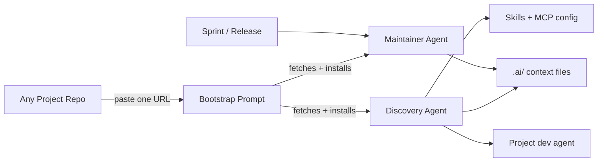

# dept-agentic-standards

`dept-agentic-standards` is the DEPT framework for making Managed Services projects AI-ready. It provides two executable agents, a self-installing bootstrap prompt, and templates that together give any project a complete, evidence-based AI context in one step.

Managed Services teams should be able to onboard an AI agent into any project in hours, not weeks. This repository defines the minimum operational, architectural, and governance context required for that outcome.

## What it does



One URL in Copilot Chat bootstraps everything. No cloning this repo. No manual file copying.

The bootstrap process also checks for Confluence documentation and environment URLs (test, acc, prod), prompting for any missing information and storing it in the generated context files and package.json.

## The agents

### AI Project Discovery Agent

`agents/ai-project-discovery.agent.md` — runs once to set up a new project. It:

1. Inventories any existing agentic setup already in the repo (agents, instructions, MCP config).
2. Maps architecture, runtime boundaries, and monorepo structure from code evidence.
3. Generates all nine `.ai/` context files with confidence scores and validation questions.
4. Wires every AI tool (Copilot, Claude, Cursor) to read `.ai/` — appending to existing config, never overwriting.
5. Searches the live [`gh skill` registry](https://agentskills.io) for every detected technology and installs matching skills into `.github/skills/`.
6. Queries the live [MCP registry](https://registry.modelcontextprotocol.io) and the [DEPT curated registry](config/mcp-registry.yml) per detected technology — merges official MCP servers into `.vscode/mcp.json`, `.cursor/mcp.json`, and `.mcp.json`.
7. Generates a project developer agent (`.github/agents/project-dev-agent.agent.md`) wired to all installed skills and MCP tools.
8. Flags unresolved gaps for human validation.

### AI Project Maintainer Agent

`agents/ai-project-maintainer.agent.md` — run after each sprint, release, or infrastructure change. It:

1. Detects what has changed using git history and file evidence.
2. Assesses staleness per `.ai/` file (critical / moderate / minor / current).
3. Applies targeted updates to affected sections — preserving correct content.
4. Captures new unknowns as validation questions.
5. Produces a change summary of what was updated and why.

## How to bootstrap a new project

Open **GitHub Copilot Chat** inside the target project and paste this URL:

```
https://raw.githubusercontent.com/dept/beno-dept-internal-agentic-ms/main/prompts/bootstrap-project-context.prompt.md
```

Press Enter. The agent fetches the prompt from this repo and runs. No manual file copying needed.

**What gets created:**

| Path | What |
|---|---|
| `.github/agents/ai-project-discovery.agent.md` | Discovery agent (installed from this repo) |
| `.github/agents/ai-project-maintainer.agent.md` | Maintainer agent (installed from this repo) |
| `.github/prompts/bootstrap-project-context.prompt.md` | This prompt (for future re-runs) |
| `.ai/*.md` | Nine context files describing the project (now includes Confluence and environment URLs) |
| `.github/copilot-instructions.md` | Copilot wiring to read `.ai/` |
| `CLAUDE.md` | Claude wiring to read `.ai/` |
| `.github/instructions/ai-context.instructions.md` | Shared instructions for all tools |
| `.github/skills/<name>/SKILL.md` | Skills per detected technology |
| `.vscode/mcp.json` / `.cursor/mcp.json` / `.mcp.json` | MCP server config per detected technology |
| `.github/agents/project-dev-agent.agent.md` | Project dev agent with all tools wired |

Existing files are never overwritten — agents append or skip.

## After bootstrap

**Review:** Open each `.ai/` file and resolve the `Validation Questions` — gaps the agent flagged but could not verify from code alone. Also verify that the Confluence page and environment URLs (test, acc, prod) were correctly captured in the appropriate files and that package.json has been updated with this information. Commit to a feature branch and open a PR.

**Keep current:** After each sprint or release, select **AI Project Maintainer** in the agent picker and run it.

## Repository structure

```
agents/          # Executable agents (copy to .github/agents/ in target project)
prompts/         # Bootstrap prompt (reference by URL, no copy needed)
config/          # Stack detection patterns + DEPT curated MCP registry
standards/       # Agentic project standard documentation
templates/       # .ai/ file templates used by the discovery agent
docs/            # Vision and roadmap
examples/        # Example .ai/ output
```

## Roadmap

See `docs/roadmap.md`. Short version: harden the standard → automate discovery → scale across managed services → specialized agents → commercial offering.
