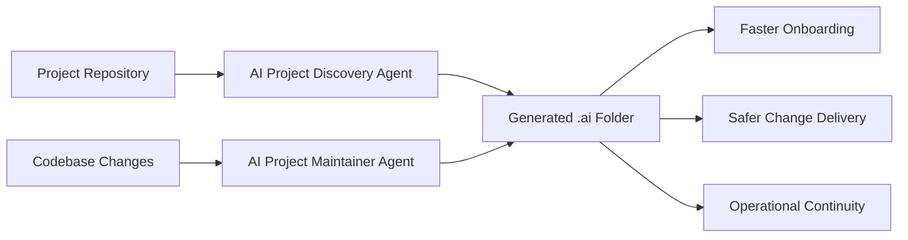

# dept-agentic-standards

`dept-agentic-standards` is the baseline framework for making DEPT Managed Services projects AI-ready from day one.

It provides:
- standards for what a project must document for reliable AI assistance;
- reusable agent instructions for rapid repository discovery;
- templates for generating consistent `.ai` project context;
- prompts and examples for repeatable adoption.

## Vision for Agentic Managed Services

Managed Services teams should be able to onboard an AI agent into any project in hours, not weeks. This repository defines the minimum operational, architectural, and governance context required for that outcome.



## How the Agents Work

### AI Project Discovery Agent

The agent in `agents/ai-project-discovery-agent.agent.md` is a fully executable VS Code agent. Copy it to `.github/agents/` in your project, then select it from the agent picker in Copilot Chat and it will:
1. Inventory any existing agentic setup (agents, instructions, prompts, MCP config) already in the repo.
2. Map system architecture, runtime boundaries, and monorepo structure.
3. Extract dependencies, integrations, deployment, CMS, monitoring, and coding standards.
4. Produce all nine `.ai` files with confidence scores, assumptions, and validation questions.
5. Wire AI tools (Copilot, Claude) to read `.ai/` — creating or appending to existing config files.
6. **Install developer skills** — searches the live public `gh skill` registry ([agentskills.io](https://agentskills.io)) for every detected technology. Works for any stack, not just a predefined list. Skills land in `.github/skills/`.
7. **Add MCP server config** — queries the live [MCP registry](https://registry.modelcontextprotocol.io) per detected technology and merges official servers into `.vscode/mcp.json` (VS Code), `.cursor/mcp.json` (Cursor), and `.mcp.json` (Claude Code). Never overwrites existing entries.
8. **Create a project developer agent** (`.github/agents/project-dev-agent.agent.md`) listing all installed skills.
9. Flag unresolved gaps for human validation.

### AI Project Maintainer Agent

The agent in `agents/ai-project-maintainer-agent.agent.md` keeps the `.ai` folder current as the project evolves:
1. Detects what has changed since the last `.ai` update using git history and file evidence.
2. Assesses staleness severity per file (critical / moderate / minor / current).
3. Applies targeted updates to affected sections only — correct content is preserved.
4. Captures new unknowns as validation questions.
5. Produces a change summary with a clear record of what was updated and why.

Run the Maintainer Agent after each sprint, release, infrastructure change, or incident postmortem.

## How to Bootstrap a New Project

### Step 1 — Copy agents and prompt into the project

```bash
cp agents/ai-project-discovery-agent.agent.md /path/to/your-project/.github/agents/
cp agents/ai-project-maintainer-agent.agent.md /path/to/your-project/.github/agents/
cp prompts/bootstrap-project-context.prompt.md /path/to/your-project/.github/prompts/
```

The `templates/` directory contains reference templates used by the agents internally — you do not need to copy them manually. The Discovery Agent generates all `.ai/` content from actual repository evidence.

During bootstrap, the agent automatically creates:
- **`.ai/`** — nine context files describing the project
- **AI wiring files** — `.github/copilot-instructions.md`, `CLAUDE.md`, `.github/instructions/ai-context.instructions.md` so every AI tool reads `.ai/`
- **Developer skills** — fetched from the public `gh skill` registry ([agentskills.io](https://agentskills.io)) per detected technology and installed into `.github/skills/`
- **MCP config** — `.vscode/mcp.json`, `.cursor/mcp.json`, `.mcp.json` entries for technologies with official MCP servers (merged, never overwritten)
- **Project dev agent** — `.github/agents/project-dev-agent.agent.md` with all skills wired in

After bootstrap, any developer opening the project can select **Project Developer** from the agent picker and immediately get context-aware help with all the right skills loaded.

### Step 2 — Run the Discovery Agent

In GitHub Copilot Chat, select **AI Project Discovery Agent** from the agent picker, then send:

```
Bootstrap this project's .ai folder
```

Or run the slash command `/bootstrap-project-context`. The agent reads the repository and generates all nine `.ai` files automatically.

### Step 3 — Review and approve

1. Review all generated `.ai` files.
2. Resolve `Validation Questions` — gaps the agent could not verify from code alone.
3. Commit `.ai/` to a feature branch and open a PR for team review.
4. Merge when approved.

### Step 4 — Keep it current

After each sprint or release, select the **AI Project Maintainer Agent** in Copilot Chat and run it. It detects what changed and updates only the affected sections.

## Future Roadmap

Roadmap details are in `docs/roadmap.md`. In short:
- establish and harden the project standard;
- operationalize discovery automation;
- scale AI-ready managed services delivery;
- expand into specialized service agents;
- package as a commercial Agentic Managed Services offering.
