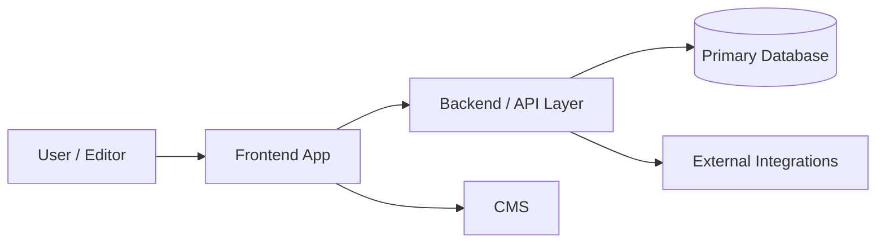

# Confluence Project Documentation Standard

## Purpose
Keep Confluence project handover pages structurally consistent across repositories while still allowing small project-specific additions.

This is the **canonical base layout** for DEPT Managed Services project documentation in Confluence. When creating or updating project pages, keep the page names, page order, and section order the same unless there is a strong project-specific reason to deviate.

## Fixed page tree
Every project should use this structure under `MS / Projects`:

- `[Project Name]` ← landing page: Key facts, AI tooling status, Key contacts
  - `[Project Name] - Overview`
  - `[Project Name] - Architecture & Package Map`
  - `[Project Name] - Environments & Access`
  - `[Project Name] - Onboarding & Handover`

### Page titles (collision-safe — required)
The `MS` space is **shared across many projects**, so generic subpage titles like `Overview` and
`Architecture & Package Map` collide and cause the Maintainer to resolve the wrong page. Therefore:

- **Landing page:** use the human project name as-is, **no affix** — e.g. `DEPT Client Portal`.
  This value is the **landing title** referenced below.
- **All four subpages:** **prefix** the standard subpage name with the landing title and ` - ` —
  i.e. `<landing title> - <subpage name>` — e.g. `DEPT Client Portal - Overview`,
  `DEPT Client Portal - Architecture & Package Map`. The prefix (not a suffix) groups a project's
  pages together when the space is sorted by title.

Record the **full, prefixed** titles in the `.ai/.meta.yml` `confluence:` block, and always look
pages up by that full title when creating or syncing.

## Standardization rules
- Keep the same four subpages for every project when possible.
- Keep the same section order inside each page.
- Add project-specific sections only **after** the standard sections unless the extra content must be interleaved for clarity.
- Do not create extra sibling pages such as `Coding Standards`, `Dependencies`, or `Runbooks` unless explicitly requested.
- Use clear mixed-audience language: understandable for both engineers and client managers.
- If `doc/` or `docs/` exists in the repository, use it as a primary wording source, then verify important claims against code and config.
- Sanitize titles before creating Confluence pages: decode HTML entities and prefer readable words over raw symbols.

---

## Main / landing page — [Project Name]

The `[Project Name]` page is the top-level Confluence entry point. It should let any reader instantly identify the project and know who to contact — without navigating into subpages.

### Required sections
1. Short intro paragraph (project type, client, agency)
2. `## Key facts`
3. `## Quick links`
4. `## Documentation structure`
5. `## AI tooling status`
6. `## Key contacts`

### Content rules
- Keep it short and scannable — this is a landing page, not a deep dive.
- `## Key contacts` must be the **last section**.
- Include a warning panel in `## Key contacts` when contact details have not yet been confirmed.
- Include a `## Key facts` table: repo, framework, package manager, CMS, hosting, database, monitoring. Use `[To fill in]` for unknowns.
- Include a `## AI tooling status` section listing which DEPT agentic standard components are in place. Use a warning panel when setup has not yet been confirmed.

### Example section skeleton
```md
## Key facts
| Property | Value |
| --- | --- |
| GitHub repo | `org/repo-name` |
| Package manager | [e.g. pnpm / bun / npm] |
| Framework | [e.g. Next.js 15 / .NET 9] |
| CMS | [To fill in] |
| Hosting | [To fill in] |
| Database | [To fill in] |
| Monitoring | [To fill in] |

## Quick links
| Link | URL |
| --- | --- |
| GitHub | ... |
| Test | ... |
| Acceptance | ... |
| Production | ... |
| Secrets (Keeper) | ... |

## Documentation structure
- **Overview** — what the system does, business capabilities, key packages
- **Architecture and Package Map** — service boundaries, external systems, packages
- **Environments and Access** — environment URLs, CI/CD, env vars
- **Onboarding and Handover** — local setup, troubleshooting, key contacts

## AI tooling status
> [!WARNING]
> Fill in or remove this warning once AI tooling setup has been confirmed.

- **Context files:** [e.g. `.ai/` directory with N context documents]
- **Agents:** [e.g. Discovery, Maintainer, Support in `.github/agents/`]
- **Skills:** [e.g. N skills in `.github/skills/`]
- **Code graph:** [e.g. Graphify — X nodes, Y edges]
- **MCP servers:** [e.g. list of configured integrations]
- **Instructions:** [e.g. `AGENTS.md`, `CLAUDE.md`, `.github/copilot-instructions.md`]

## Key contacts
> [!WARNING]
> Verify contact details with the project team before sharing this page.

| Role | Name | Contact (email) |
| --- | --- | --- |
| Tech Lead | [To fill in] | [To fill in] |
| Client Manager | [To fill in] | [To fill in] |
| Project Manager | [To fill in] | [To fill in] |
| DevOps Owner | [To fill in] | [To fill in] |
| CMS Admin | [To fill in] | [To fill in] |
```

---

## Page 1 — Overview

### Required sections
1. `## What this project does`
2. `## Business capabilities`
3. `## Major areas at a glance`
4. `## Key links`

### Content rules
- Explain the system in plain language first.
- Summarize the main business capabilities.
- If the repository has multiple apps, packages, brands, campaigns, or major features, include a short explanation for each major area.
- Include the core project links collected during discovery.

### Example section skeleton
```md
## What this project does
Short plain-language summary of the product/system.

## Business capabilities
- Capability 1
- Capability 2
- Capability 3

## Major areas at a glance
| Area | Purpose | Notes |
| --- | --- | --- |
| apps/web | Main customer-facing web app | Uses CMS + backend APIs |
| packages/design-system | Shared UI components | Used by all frontend apps |

## Key links
- GitHub:
- Test:
- Acceptance:
- Production:
- Keeper / credential reference:
```

---

## Page 2 — Architecture & Package Map

### Required sections
1. `## Architecture overview`
2. `## Package and component inventory`
3. `## Major area summaries`
4. `## Runtime flow and integrations`
5. `## Risks and structural notes`

### Content rules
- Put a **Mermaid diagram** at the top of this page under `## Architecture overview`.
- The diagram must be a quick structural overview, not a screenshot, ASCII tree, or pseudo-diagram.
- Prefer `flowchart LR` or `flowchart TD`.
- Keep it high level: entrypoints, major internal apps/services/packages, and key external systems.
- Include an inventory table for quick scanning.
- Include a short summary for each major app/package/feature/campaign explaining what it is for.

### Example Mermaid pattern


### Example section skeleton
```md
## Architecture overview


## Package and component inventory
| Area | Type | Responsibility | Key dependencies |
| --- | --- | --- | --- |
| apps/web | App | Main customer experience | CMS, API |
| packages/shared | Package | Shared utilities | Internal consumers |

## Major area summaries
### apps/web
Short explanation of what this app does and why it exists.

### packages/shared
Short explanation of what this package does and who uses it.

## Runtime flow and integrations
Describe the main request/content/data flow and external systems.

## Risks and structural notes
Call out hotspots, fragile dependencies, trust boundaries, or discovery uncertainty.
```

---

## Page 3 — Environments & Access

### Required sections
1. `## Environment overview`
2. `## URLs and endpoints`
3. `## Access model`
4. `## Deployment and release notes`
5. `## Operational references`

### Content rules
- Always include GitHub, test, acceptance, and production links when they exist.
- Include Keeper reference or the equivalent credential-management location.
- Explain access prerequisites and any approval or deployment constraints.
- Keep this page practical and operational.

### Example section skeleton
```md
## Environment overview
Short explanation of the available environments and what they are used for.

## URLs and endpoints
| Environment | Purpose | URL | Notes |
| --- | --- | --- | --- |
| Test | Internal testing | ... | ... |
| Acceptance | Client validation | ... | ... |
| Production | Live traffic | ... | ... |

## Access model
- GitHub:
- Hosting / cloud:
- CMS:
- Analytics:
- Keeper / secrets:

## Deployment and release notes
- Release cadence:
- Approval flow:
- Rollback note:

## Operational references
- Monitoring:
- Alerts:
- Incident channel:
```

---

## Page 4 — Onboarding & Handover

### Required sections
1. `## First-day setup`
2. `## Local development workflow`
3. `## Troubleshooting and common gotchas`
4. `## Support and escalation`
5. `## Handover notes`

### Content rules
- Optimize for a new engineer joining the project.
- Include setup prerequisites, local run/test commands, and known pitfalls.
- Include support paths and escalation guidance.
- Do **not** repeat a Key Contacts table here — contacts live on the main `[Project Name]` landing page. Link to it instead if readers need it.
- Include project-specific handover notes that would otherwise be lost in code or chat history.

### Example section skeleton
```md
## First-day setup
- Install prerequisites
- Request access
- Fetch secrets

## Local development workflow
- Install:
- Run:
- Test:
- Build:

## Troubleshooting and common gotchas
- Gotcha 1
- Gotcha 2

## Support and escalation
- Primary team:
- Escalation path:
- After-hours note:

## Handover notes
- Known risks
- Pending migrations
- Project-specific operational caveats
```

---

## `.ai/` → Confluence page mapping (canonical)

The `.ai/` folder has ~9 files; the Confluence tree has 4 subpages + a landing page. To stop agents guessing titles (and creating duplicates), the mapping is fixed and each page's real ID is recorded in `.ai/.meta.yml` after first creation.

| `.ai/` file | Confluence page |
| --- | --- |
| `project-context.md` | Overview |
| `architecture.md` | Architecture & Package Map |
| `cms.md` | Architecture & Package Map |
| `dependencies.md` | Architecture & Package Map |
| `operational-context.md` | Environments & Access |
| `runbooks.md` | Environments & Access |
| `onboarding.md` | Onboarding & Handover |
| `coding-standards.md` | Onboarding & Handover |
| `agent-registry.md` | landing page → `## AI tooling status` section |

### `.meta.yml` `confluence:` block (schema)

Discovery writes this block on first Confluence creation; the Maintainer reads it every sync. `id` is empty until resolved — the agent looks the page up by `title` under the space and **writes the ID back**, so subsequent runs update in place instead of duplicating.

```yaml
confluence:
  space: MS
  base_url: https://dept-nl.atlassian.net/wiki/spaces/MS/Projects
  pages:
    # Landing: human project name, no affix. Subpages: PREFIXED with the landing
    # title — "<landing title> - <subpage>" — to stay unique in the shared MS space
    # and group a project's pages together.
    landing:      { title: "[Project Name]", id: "" }
    overview:     { title: "[Project Name] - Overview", id: "" }
    architecture: { title: "[Project Name] - Architecture & Package Map", id: "" }
    environments: { title: "[Project Name] - Environments & Access", id: "" }
    onboarding:   { title: "[Project Name] - Onboarding & Handover", id: "" }
  sync_map:
    project-context.md: overview
    architecture.md: architecture
    cms.md: architecture
    dependencies.md: architecture
    operational-context.md: environments
    runbooks.md: environments
    onboarding.md: onboarding
    coding-standards.md: onboarding
    agent-registry.md: landing
```

`sync_map` entries for `.ai/` files that don't exist in a given project (e.g. `cms.md` on a non-CMS repo) are ignored.

## Allowed customization
Customization is allowed, but the default should be:
- same page names
- same page order
- same core section headings
- same architecture-page Mermaid convention

Good customization examples:
- add `## Campaign lifecycle` for a campaign-heavy project
- add `## Brand split` for a multi-brand repository
- add `## Data contracts` if integrations are central to the project

Bad customization examples:
- replacing the standard four-page structure with ad-hoc pages
- skipping the architecture overview diagram
- using only package lists without plain-language summaries
- using screenshots instead of an editable Mermaid overview

## Enforcement guidance for agents
When an agent creates Confluence documentation, it should:
1. follow this document as the canonical Confluence structure source
2. create the standard page tree first
3. fill the standard sections in order
4. add project-specific sections only when needed
5. explain any structural deviation explicitly in its final report
6. place Key facts, AI tooling status, and Key contacts **only on the main `[Project Name]` landing page** — never repeat them on Overview, Architecture, or Onboarding subpages
7. title pages per the **Page titles (collision-safe)** rule above: landing = project name (no affix), every subpage prefixed with the landing title (`<landing title> - <subpage>`); write the full titles into `.ai/.meta.yml` and resolve pages by them

## Recommended implementation pattern in prompts and skills
To reduce drift, prompts and skills should say:
- use `docs/confluence-page-standard.md` as the canonical page-layout source
- keep exact page names unless there is a strong reason not to
- keep section order stable across projects
- add custom sections only after the standard ones when possible
