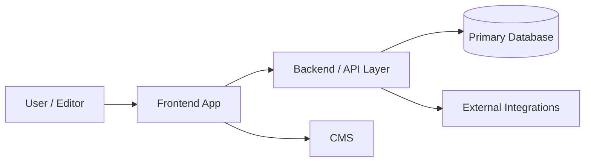

# Confluence Project Documentation Standard

## Purpose
Keep Confluence project handover pages structurally consistent across repositories while still allowing small project-specific additions.

This is the **canonical base layout** for DEPT Managed Services project documentation in Confluence. When creating or updating project pages, keep the page names, page order, and section order the same unless there is a strong project-specific reason to deviate.

## Fixed page tree
Every project should use this structure under `MS / Projects`:

- `[Project Name]`
  - `Overview`
  - `Architecture & Package Map`
  - `Environments & Access`
  - `Onboarding & Handover`

## Standardization rules
- Keep the same four subpages for every project when possible.
- Keep the same section order inside each page.
- Add project-specific sections only **after** the standard sections unless the extra content must be interleaved for clarity.
- Do not create extra sibling pages such as `Coding Standards`, `Dependencies`, or `Runbooks` unless explicitly requested.
- Use clear mixed-audience language: understandable for both engineers and client managers.
- If `doc/` or `docs/` exists in the repository, use it as a primary wording source, then verify important claims against code and config.
- Sanitize titles before creating Confluence pages: decode HTML entities and prefer readable words over raw symbols.

---

## Page 1 — Overview

### Required sections
1. `## What this project does`
2. `## Business capabilities`
3. `## Major areas at a glance`
4. `## Ownership and contacts`
5. `## Key links`

### Content rules
- Explain the system in plain language first.
- Summarize the main business capabilities.
- If the repository has multiple apps, packages, brands, campaigns, or major features, include a short explanation for each major area.
- Include ownership, support contacts, and client-facing context when known.
- Include the core project links collected during discovery.

### Example section skeleton
```md
## What this project does
Short plain-language summary of the product/system.

## Business capabilities
- Capability 1
- Capability 2
- Capability 3

## Major areas at a glance
| Area | Purpose | Notes |
| --- | --- | --- |
| apps/web | Main customer-facing web app | Uses CMS + backend APIs |
| packages/design-system | Shared UI components | Used by all frontend apps |

## Ownership and contacts
- Delivery owner:
- Technical owner:
- Client manager:
- Support path:

## Key links
- GitHub:
- Test:
- Acceptance:
- Production:
- Keeper / credential reference:
```

---

## Page 2 — Architecture & Package Map

### Required sections
1. `## Architecture overview`
2. `## Package and component inventory`
3. `## Major area summaries`
4. `## Runtime flow and integrations`
5. `## Risks and structural notes`

### Content rules
- Put a **Mermaid diagram** at the top of this page under `## Architecture overview`.
- The diagram must be a quick structural overview, not a screenshot, ASCII tree, or pseudo-diagram.
- Prefer `flowchart LR` or `flowchart TD`.
- Keep it high level: entrypoints, major internal apps/services/packages, and key external systems.
- Include an inventory table for quick scanning.
- Include a short summary for each major app/package/feature/campaign explaining what it is for.

### Example Mermaid pattern


### Example section skeleton
```md
## Architecture overview


## Package and component inventory
| Area | Type | Responsibility | Key dependencies |
| --- | --- | --- | --- |
| apps/web | App | Main customer experience | CMS, API |
| packages/shared | Package | Shared utilities | Internal consumers |

## Major area summaries
### apps/web
Short explanation of what this app does and why it exists.

### packages/shared
Short explanation of what this package does and who uses it.

## Runtime flow and integrations
Describe the main request/content/data flow and external systems.

## Risks and structural notes
Call out hotspots, fragile dependencies, trust boundaries, or discovery uncertainty.
```

---

## Page 3 — Environments & Access

### Required sections
1. `## Environment overview`
2. `## URLs and endpoints`
3. `## Access model`
4. `## Deployment and release notes`
5. `## Operational references`

### Content rules
- Always include GitHub, test, acceptance, and production links when they exist.
- Include Keeper reference or the equivalent credential-management location.
- Explain access prerequisites and any approval or deployment constraints.
- Keep this page practical and operational.

### Example section skeleton
```md
## Environment overview
Short explanation of the available environments and what they are used for.

## URLs and endpoints
| Environment | Purpose | URL | Notes |
| --- | --- | --- | --- |
| Test | Internal testing | ... | ... |
| Acceptance | Client validation | ... | ... |
| Production | Live traffic | ... | ... |

## Access model
- GitHub:
- Hosting / cloud:
- CMS:
- Analytics:
- Keeper / secrets:

## Deployment and release notes
- Release cadence:
- Approval flow:
- Rollback note:

## Operational references
- Monitoring:
- Alerts:
- Incident channel:
```

---

## Page 4 — Onboarding & Handover

### Required sections
1. `## First-day setup`
2. `## Local development workflow`
3. `## Troubleshooting and common gotchas`
4. `## Support and escalation`
5. `## Handover notes`

### Content rules
- Optimize for a new engineer joining the project.
- Include setup prerequisites, local run/test commands, and known pitfalls.
- Include support paths and escalation guidance.
- Include project-specific handover notes that would otherwise be lost in code or chat history.

### Example section skeleton
```md
## First-day setup
- Install prerequisites
- Request access
- Fetch secrets

## Local development workflow
- Install:
- Run:
- Test:
- Build:

## Troubleshooting and common gotchas
- Gotcha 1
- Gotcha 2

## Support and escalation
- Primary team:
- Escalation path:
- After-hours note:

## Handover notes
- Known risks
- Pending migrations
- Project-specific operational caveats
```

---

## Allowed customization
Customization is allowed, but the default should be:
- same page names
- same page order
- same core section headings
- same architecture-page Mermaid convention

Good customization examples:
- add `## Campaign lifecycle` for a campaign-heavy project
- add `## Brand split` for a multi-brand repository
- add `## Data contracts` if integrations are central to the project

Bad customization examples:
- replacing the standard four-page structure with ad-hoc pages
- skipping the architecture overview diagram
- using only package lists without plain-language summaries
- using screenshots instead of an editable Mermaid overview

## Enforcement guidance for agents
When an agent creates Confluence documentation, it should:
1. follow this document as the canonical Confluence structure source
2. create the standard page tree first
3. fill the standard sections in order
4. add project-specific sections only when needed
5. explain any structural deviation explicitly in its final report

## Recommended implementation pattern in prompts and skills
To reduce drift, prompts and skills should say:
- use `docs/confluence-page-standard.md` as the canonical page-layout source
- keep exact page names unless there is a strong reason not to
- keep section order stable across projects
- add custom sections only after the standard ones when possible
