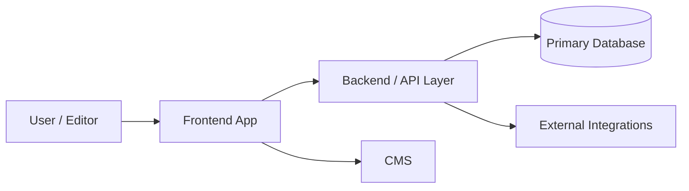

# Confluence Project Documentation Standard

## Purpose
Keep Confluence project handover pages structurally consistent across repositories while still allowing small project-specific additions.

This is the **canonical base layout** for DEPT Managed Services project documentation in Confluence. When creating or updating project pages, keep the page names, page order, and section order the same unless there is a strong project-specific reason to deviate.

**This file owns the structure; `docs/confluence-layout.md` owns the rendering.** Which pages exist,
which sections they carry and in what order is here. How a section is rendered once it belongs on
the page (table versus bullets versus code block, heading depth, canonical table columns, panels)
is in `docs/confluence-layout.md`, and it is not restated here. Read both before writing a page.

## Fixed page tree
Every project should use this structure under `MS / Projects`:

- `[Project Name]` ← landing page: Key facts, AI tooling status, Key contacts
  - `[Project Name] - Overview`
  - `[Project Name] - Architecture & Package Map`
  - `[Project Name] - Environments & Access`
  - `[Project Name] - Onboarding & Handover`

### Page titles (collision-safe — required)
The `MS` space is **shared across many projects**, so generic subpage titles like `Overview` and
`Architecture & Package Map` collide and cause the Maintainer to resolve the wrong page. Therefore:

- **Landing page:** use the human project name as-is, **no affix** — e.g. `DEPT Client Portal`.
  This value is the **landing title** referenced below.
- **All four subpages:** **prefix** the standard subpage name with the landing title and ` - ` —
  i.e. `<landing title> - <subpage name>` — e.g. `DEPT Client Portal - Overview`,
  `DEPT Client Portal - Architecture & Package Map`. The prefix (not a suffix) groups a project's
  pages together when the space is sorted by title.

Record the **full, prefixed** titles in the `.ai/.meta.yml` `confluence:` block, and always look
pages up by that full title when creating or syncing.

## Standardization rules
- Keep the same four subpages for every project when possible.
- Keep the same section order inside each page.
- Add project-specific sections only **after** the standard sections unless the extra content must be interleaved for clarity.
- Do not create extra sibling pages such as `Coding Standards`, `Dependencies`, or `Runbooks` unless explicitly requested.
- Use clear mixed-audience language: understandable for both engineers and client managers.
- **Confluence is the human surface; `.ai/` is the agent surface. Never send a human reader into `.ai/`.** These pages must stand on their own: a reader gets the answer on the page, not a pointer to a repository file written for AI tools. Do not write instructions like "read `.ai/project-context.md`, then `.ai/architecture.md`", and do not describe `.ai/` files as onboarding reading, background reading, or the fastest route into the codebase. If content only exists in `.ai/`, copy the substance onto the page in human wording instead of linking to the file.
  Two narrow exceptions, both of which describe the repository rather than instruct the reader: the landing page's *AI tooling status* section may state that `.ai/` exists and what it contains, and a sync note under a synced artifact (such as the architecture diagram) may name the `.ai/` file that owns the source, so an engineer editing it knows where to change it. Neither is an instruction to go read `.ai/` to understand the project.
- **Read the repository's own prose first.** `README.md` at the root, a per-package `README.md`, `CONTRIBUTING.md`, and a `doc/` or `docs/` folder are the primary wording source: they hold the project's own explanation of what it is, plus the conventions (commit format, branch format, required tooling, local setup order) that no config file states. Use them for wording and for facts, then verify important claims against code and config. A repository readme that documents a commit convention and does not reach the Onboarding page is the standard failing, not the readme being irrelevant.
- Sanitize titles before creating Confluence pages: decode HTML entities and prefer readable words over raw symbols.

---

## Main / landing page — [Project Name]

The `[Project Name]` page is the top-level Confluence entry point. It should let any reader instantly identify the project and know who to contact — without navigating into subpages.

### Required sections
1. Short intro paragraph (project type, client, agency)
2. `## Key facts`
3. `## Quick links`
4. `## Documentation structure`
5. `## AI tooling status`
6. `## Key contacts`

### Content rules
- Keep it short and scannable — this is a landing page, not a deep dive.
- `## Key contacts` must be the **last section**.
- Include a warning panel in `## Key contacts` when contact details have not yet been confirmed.
- Include a `## Key facts` table: repo, framework, package manager, CMS, hosting, database, monitoring. Use `[To fill in]` for unknowns.
- Include a `## AI tooling status` section listing which DEPT agentic standard components are in place. Use a warning panel when setup has not yet been confirmed.

### Example section skeleton
```md
## Key facts
| Property | Value |
| --- | --- |
| GitHub repo | `org/repo-name` |
| Package manager | [e.g. pnpm / bun / npm] |
| Framework | [e.g. Next.js 15 / .NET 9] |
| CMS | [To fill in] |
| Hosting | [To fill in] |
| Database | [To fill in] |
| Monitoring | [To fill in] |

## Quick links
| Link | URL |
| --- | --- |
| GitHub | ... |
| Test | ... |
| Acceptance | ... |
| Production | ... |
| Secrets (Keeper) | ... |

## Documentation structure
- **Overview** — what the system does, business capabilities, key packages
- **Architecture and Package Map** — service boundaries, external systems, packages
- **Environments and Access** — environment URLs, CI/CD, env vars
- **Onboarding and Handover** — local setup, troubleshooting, key contacts

## AI tooling status
> [!WARNING]
> Fill in or remove this warning once AI tooling setup has been confirmed.

- **Context files:** [e.g. `.ai/` directory with N context documents]
- **Agents:** [e.g. Discovery, Maintainer, Support in `.github/agents/`]
- **Skills:** [e.g. N skills in `.agents/skills/`, mirrored to Claude Code by the `.claude/skills` symlink]
- **Code graph:** [e.g. Graphify with X nodes, Y edges]
- **MCP servers:** [e.g. list of configured integrations]
- **Instructions:** [e.g. `AGENTS.md`, `CLAUDE.md`]

## Key contacts
> [!WARNING]
> Verify contact details with the project team before sharing this page.

| Role | Name | Contact (email) |
| --- | --- | --- |
| Tech Lead | [To fill in] | [To fill in] |
| Client Manager | [To fill in] | [To fill in] |
| Project Manager | [To fill in] | [To fill in] |
| DevOps Owner | [To fill in] | [To fill in] |
| CMS Admin | [To fill in] | [To fill in] |
```

---

## Page 1 — Overview

### Required sections
1. `## What this project does`
2. `## Business capabilities`
3. `## Key Features (Monitored)`
4. `## Major areas at a glance`
5. `## Key links`

### Content rules
- Explain the system in plain language first.
- Summarize the main business capabilities.
- `## Key Features (Monitored)` lists the live Datadog Synthetic tests for this client (fetched in discovery via the **Datadog MCP** — browser OAuth, no keys — `get_synthetics_tests` filtered by the `client:<name>` tag). Columns: **Public ID** (link), **Type** (Browser/API), **Name** (exact test name), **Description** (factual, derived from the config — do not invent). Sort **Browser first, API second**, and add a one-line note on the split (e.g. "5 browser tests + 2 API uptime tests"). This is sourced from `.ai/project-context.md` and must stay in sync with it. If the Datadog MCP was not yet reachable, keep the heading with a `[To fill in]` note rather than dropping it.
- If the repository has multiple apps, packages, brands, campaigns, or major features, include a short explanation for each major area.
- Include the core project links collected during discovery.

### Example section skeleton
```md
## What this project does
Short plain-language summary of the product/system.

## Business capabilities
- Capability 1
- Capability 2
- Capability 3

## Key Features (Monitored)
Monitored via Datadog Synthetics — 5 browser tests + 2 API uptime tests.

| Public ID | Type | Name | Description |
| --- | --- | --- | --- |
| [uzp-sne-bce](https://app.datadoghq.eu/synthetics/details/uzp-sne-bce) | Browser | Home Page Content & Search | Validates homepage content, header navigation, and search |
| [hxq-m2k-rak](https://app.datadoghq.eu/synthetics/details/hxq-m2k-rak) | Browser | Donation & Support Options | Exercises the donation and support flows |
| [wbs-ifz-bcg](https://app.datadoghq.eu/synthetics/details/wbs-ifz-bcg) | API | Homepage availability | Uptime check on the homepage endpoint |

## Major areas at a glance
| Area | Purpose | Notes |
| --- | --- | --- |
| apps/web | Main customer-facing web app | Uses CMS + backend APIs |
| packages/design-system | Shared UI components | Used by all frontend apps |

## Key links
- GitHub:
- Test:
- Acceptance:
- Production:
- Keeper / credential reference:
```

---

## Page 2 — Architecture & Package Map

### Required sections
1. `## Architecture overview`
2. `## Package and component inventory`
3. `## Major area summaries`
4. `## Runtime flow and integrations`
5. `## Risks and structural notes`

### Content rules
- Put a **Mermaid diagram** at the top of this page under `## Architecture overview`.
- Publish it with the **Mermaid Diagrams Viewer** app: a collapsed expand holding the source code block, immediately followed by the viewer macro. See *Publishing the diagram* below. The code block is the source the viewer reads, so it must stay on the page.
- The diagram must be a quick structural overview, not a screenshot, ASCII tree, or pseudo-diagram.
- Prefer `flowchart LR` or `flowchart TD`.
- Keep it high level: entrypoints, major internal apps/services/packages, and key external systems.
- Include an inventory table for quick scanning.
- Include a short summary for each major app/package/feature/campaign explaining what it is for.

### Publishing the diagram

Use the Atlassian Labs **Mermaid Diagrams Viewer** Forge app (marketplace app `1232887`, app key `com.atlassian.confluence.plugins.mermaid-diagrams-viewer`). It reads a code block from the page at view time and renders the diagram client-side, so a page written purely through the API renders correctly and keeps rendering after later edits.

Do **not** use the "Mermaid Chart for Confluence" macro or the Stratus Add-ons equivalent. Those apps cache a pre-rendered SVG inside the macro configuration. An API write cannot produce that cache, so the diagram stays blank until a human opens the editor and re-saves the macro.

The page shape is a collapsed expand holding the source, immediately followed by the viewer macro. Write it in ADF:

```json
{"type":"expand","attrs":{"title":"Diagram source"},"content":[
  {"type":"codeBlock","attrs":{"language":"ruby"},
   "content":[{"type":"text","text":"flowchart LR\n    User[User / Editor] --> Frontend[Frontend App]\n    Frontend --> API[Backend / API Layer]\n    API --> DB[(Primary Database)]"}]}]}
{"type":"extension","attrs":{
  "layout":"default",
  "extensionType":"com.atlassian.ecosystem",
  "extensionKey":"23392b90-4271-4239-98ca-a3e96c663cbb/63d4d207-ac2f-4273-865c-0240d37f044a/static/mermaid-diagram",
  "text":"Mermaid diagram",
  "parameters":{
    "layout":"extension",
    "guestParams":{"index":0},
    "forgeEnvironment":"PRODUCTION",
    "extensionId":"ari:cloud:ecosystem::extension/23392b90-4271-4239-98ca-a3e96c663cbb/63d4d207-ac2f-4273-865c-0240d37f044a/static/mermaid-diagram",
    "extensionTitle":"Mermaid diagram"}}}
```

Rules:

- **`guestParams` must be `{"index": N}`.** `N` is the 0-based position of this diagram's source among **all** code blocks on the page, counted recursively so blocks nested inside expands count too. A page with two diagrams uses index `0` and index `1`. Leaving it `""` (the editor's "Auto detect") produces *Error while loading diagram* on any API-written page. This is the single detail most likely to break a generated page.
- The viewer finds code blocks inside a **collapsed** expand, so readers see the diagram with the source tucked behind a `Diagram source` toggle. Keep it that way.
- The code block `language` is cosmetic for this app. Do not tag it `mermaid`.
- The source is a verbatim copy of the `mermaid` block in `.ai/architecture.md`, which remains the single source of truth. State that under the diagram, and tell the reader to change the repository file and re-sync instead of editing the diagram in place.
- The app id and environment id above are **specific to the dept-nl site install**. If the app is reinstalled, or another Confluence site is targeted, read a live page's ADF back and copy the current `extensionKey` and `extensionId` from it.
- The diagram appears 10 to 20 seconds after page load. Wait that long before calling a page broken.
- Verify by reading the page ADF back (`npx -y confluence-axi page get <id> --format adf --full`) and confirming the expand plus extension pair with the right `index`, rather than only eyeballing the rendered page.
- If the site has no Mermaid app installed, keep the code block on its own and record "request the Atlassian Labs Mermaid Diagrams Viewer app" as an open handover item.

### Example Mermaid pattern

The source that goes into the code block (shown here as a fenced block for readability only):


```mermaid
flowchart LR
    User[User / Editor] --> Frontend[Frontend App]
    Frontend --> API[Backend / API Layer]
    Frontend --> CMS[CMS]
    API --> DB[(Primary Database)]
    API --> Integrations[External Integrations]
```

### Example section skeleton
```md
## Architecture overview

```mermaid
flowchart LR
    User[User / Editor] --> Frontend[Frontend App]
    Frontend --> API[Backend / API Layer]
    Frontend --> CMS[CMS]
    API --> DB[(Primary Database)]
    API --> Integrations[External Integrations]
```

## Package and component inventory
| Area | Type | Responsibility | Key dependencies |
| --- | --- | --- | --- |
| apps/web | App | Main customer experience | CMS, API |
| packages/shared | Package | Shared utilities | Internal consumers |

## Major area summaries
### apps/web
Short explanation of what this app does and why it exists.

### packages/shared
Short explanation of what this package does and who uses it.

## Runtime flow and integrations
Describe the main request/content/data flow and external systems.

## Risks and structural notes
Call out hotspots, fragile dependencies, trust boundaries, or discovery uncertainty.
```

---

## Page 3 — Environments & Access

### Required sections
1. `## Environment overview`
2. `## URLs and endpoints`
3. `## Access model`
4. `## Deployment and release notes`
5. `## Operational references`

### Content rules
- Always include GitHub, test, acceptance, and production links when they exist.
- Include Keeper reference or the equivalent credential-management location.
- Explain access prerequisites and any approval or deployment constraints.
- Keep this page practical and operational.

### Example section skeleton
```md
## Environment overview
Short explanation of the available environments and what they are used for.

## URLs and endpoints
| Environment | Purpose | URL | Notes |
| --- | --- | --- | --- |
| Test | Internal testing | ... | ... |
| Acceptance | Client validation | ... | ... |
| Production | Live traffic | ... | ... |

## Access model
- GitHub:
- Hosting / cloud:
- CMS:
- Analytics:
- Keeper / secrets:

## Deployment and release notes
- Release cadence:
- Approval flow:
- Rollback note:

## Operational references
- Monitoring:
- Alerts:
- Incident channel:
```

---

## Page 4 — Onboarding & Handover

### Required sections
1. `## First-day setup`
2. `## Local development workflow`
3. `## Troubleshooting and common gotchas`
4. `## Support and escalation`
5. `## Handover notes`

### Content rules
- Optimize for a new engineer joining the project.
- Write the onboarding path in human terms: what to install, what access to request, what to run, what to read *on Confluence*. Never route the new engineer through `.ai/` — those files are written for AI tools, and "read `.ai/project-context.md` first" is not an onboarding step for a person. Put the orientation itself on this page and link to the Overview and Architecture pages for depth.
- Include setup prerequisites, local run/test commands, and known pitfalls.
- **`## Local development workflow` is a `Task` / `Command` / `Notes` table with a row per command a developer runs on every task**, copied from the cheatsheet in `.ai/onboarding.md`. The minimum row set is **Install, Run, Test, Build, Commit**, plus any project-specific loop (a watch task, a container start, a CMS bootstrap step).
- **The Commit row is not optional, and it carries the convention.** Name the wrapper command the project enforces (for example `pnpm commit` via Commitizen, when git hooks reject a hand-written message), then state the commit and branch format under the table, sourced from `.ai/coding-standards.md` (which owns the convention) and from `README.md`/`CONTRIBUTING.md` where the repository documents it. A page that lists Install, Run, Test and Build and stops leaves a new engineer with a rejected first commit and no idea why, which is the exact omission this rule exists to prevent.
- Include support paths and escalation guidance.
- Do **not** repeat a Key Contacts table here — contacts live on the main `[Project Name]` landing page. Link to it instead if readers need it.
- Include project-specific handover notes that would otherwise be lost in code or chat history.

### Example section skeleton
```md
## First-day setup
1. Install prerequisites
2. Request access
3. Fetch secrets

## Local development workflow
| Task | Command | Notes |
| --- | --- | --- |
| Install | `pnpm install` | Run in the repository root unless noted |
| Run | `pnpm dev` | ... |
| Test | `pnpm test` | ... |
| Build | `pnpm build` | Also the pre-push gate |
| Commit | `pnpm commit` | Commitizen prompt; git hooks reject a hand-written message |

**Commit and branch conventions.** Commit: `<type>(TICKET-<number>): <description>`.
Branch: `<type>/TICKET-<number>/<description>`. Use `TICKET-000` when there is no ticket.

## Troubleshooting and common gotchas
| Symptom | Cause | Fix |
| --- | --- | --- |
| ... | ... | ... |

## Support and escalation
- Primary team:
- Escalation path:
- After-hours note:

## Handover notes
- Known risks
- Pending migrations
- Project-specific operational caveats
```

---

## `.ai/` → Confluence page mapping (canonical)

The `.ai/` folder has ~9 files; the Confluence tree has 4 subpages + a landing page. To stop agents guessing titles (and creating duplicates), the mapping is fixed and each page's real ID is recorded in `.ai/.meta.yml` after first creation.

| `.ai/` file | Confluence page |
| --- | --- |
| `project-context.md` | Overview |
| `architecture.md` | Architecture & Package Map |
| `cms.md` | Architecture & Package Map |
| `dependencies.md` | Architecture & Package Map |
| `operational-context.md` | Environments & Access |
| `runbooks.md` | Environments & Access |
| `onboarding.md` | Onboarding & Handover |
| `coding-standards.md` | Onboarding & Handover |
| `agent-registry.md` | landing page → `## AI tooling status` section |

### `.meta.yml` `confluence:` block (schema)

Discovery writes this block on first Confluence creation; the Maintainer reads it every sync. `id` is empty until resolved — the agent looks the page up by `title` under the space and **writes the ID back**, so subsequent runs update in place instead of duplicating.

```yaml
confluence:
  space: MS
  base_url: https://dept-nl.atlassian.net/wiki/spaces/MS/Projects
  pages:
    # Landing: human project name, no affix. Subpages: PREFIXED with the landing
    # title — "<landing title> - <subpage>" — to stay unique in the shared MS space
    # and group a project's pages together.
    landing:      { title: "[Project Name]", id: "" }
    overview:     { title: "[Project Name] - Overview", id: "" }
    architecture: { title: "[Project Name] - Architecture & Package Map", id: "" }
    environments: { title: "[Project Name] - Environments & Access", id: "" }
    onboarding:   { title: "[Project Name] - Onboarding & Handover", id: "" }
  sync_map:
    project-context.md: overview
    architecture.md: architecture
    cms.md: architecture
    dependencies.md: architecture
    operational-context.md: environments
    runbooks.md: environments
    onboarding.md: onboarding
    coding-standards.md: onboarding
    agent-registry.md: landing
```

`sync_map` entries for `.ai/` files that don't exist in a given project (e.g. `cms.md` on a non-CMS repo) are ignored.

## Allowed customization
Customization is allowed, but the default should be:
- same page names
- same page order
- same core section headings
- same architecture-page Mermaid convention

Good customization examples:
- add `## Campaign lifecycle` for a campaign-heavy project
- add `## Brand split` for a multi-brand repository
- add `## Data contracts` if integrations are central to the project

Bad customization examples:
- replacing the standard four-page structure with ad-hoc pages
- skipping the architecture overview diagram
- using only package lists without plain-language summaries
- using screenshots instead of an editable Mermaid overview
- publishing the Mermaid source as a fenced code block instead of a rendering Mermaid macro
- pointing human readers at `.ai/` files, e.g. "read the context files in order: `.ai/project-context.md`, then `.ai/architecture.md`" as an onboarding step. Those files are the agent surface; put the substance on the page instead

## Enforcement guidance for agents
When an agent creates Confluence documentation, it should:
1. follow this document as the canonical Confluence structure source, and `docs/confluence-layout.md` as the canonical rendering source
2. create the standard page tree first
3. fill the standard sections in order, choosing each section's block type per `docs/confluence-layout.md` → *Rule 0* and its canonical column sets
4. add project-specific sections only when needed
5. explain any structural deviation explicitly in its final report
6. place Key facts, AI tooling status, and Key contacts **only on the main `[Project Name]` landing page** — never repeat them on Overview, Architecture, or Onboarding subpages
7. write for the human reader and keep `.ai/` out of the pages, per the Confluence-is-human rule in **Standardization rules** above; the landing page's AI tooling status entry and the diagram sync note are the only permitted mentions
8. title pages per the **Page titles (collision-safe)** rule above: landing = project name (no affix), every subpage prefixed with the landing title (`<landing title> - <subpage>`); write the full titles into `.ai/.meta.yml` and resolve pages by them

## Recommended implementation pattern in prompts and skills
To reduce drift, prompts and skills should say:
- use `docs/confluence-page-standard.md` as the canonical page-structure source and `docs/confluence-layout.md` as the canonical rendering source
- keep exact page names unless there is a strong reason not to
- keep section order stable across projects
- add custom sections only after the standard ones when possible
- render each section with the block type and column set `docs/confluence-layout.md` prescribes, rather than choosing per project
