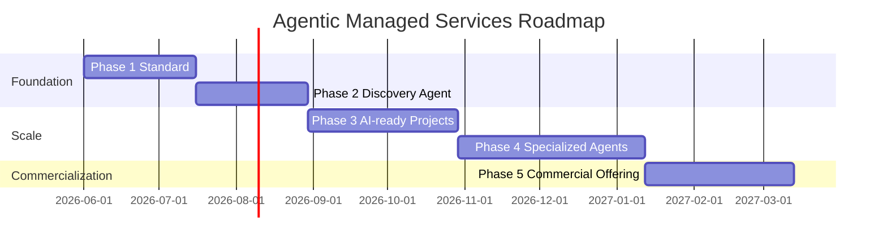

# Roadmap

## Phase 1: Agentic Project Standard

### Goals
- Define mandatory AI-readiness baseline for Managed Services projects.

### Deliverables
- `standards/agentic-project-standard.md`
- `.ai` required file model and governance rules

### Success Metrics
- Standard approved by platform and managed services leadership
- Initial pilot projects adopting required `.ai` structure

## Phase 2: Project Agents

### Goals
- Provide repeatable repository discovery and `.ai` generation.
- Prevent documentation rot through automated maintenance after each sprint or release.

### Deliverables
- `agents/ai-project-discovery-agent.agent.md` — generates the `.ai` folder from scratch
- `agents/ai-project-maintainer-agent.agent.md` — keeps the `.ai` folder current as the project evolves
- Bootstrap prompt and templates

### Success Metrics
- Discovery output generated for pilot repositories in <1 day
- Reduced manual onboarding effort compared to baseline
- `.ai` folders remain accurate across multiple sprint cycles without full regeneration

## Phase 3: AI-ready Managed Services Projects

### Goals
- Scale `.ai` adoption across active managed services engagements.

### Deliverables
- Rollout plan and implementation support package
- Project-level onboarding and governance checklist

### Success Metrics
- Majority of managed services projects maintain versioned `.ai` folders
- Measurable reduction in onboarding and incident triage time

## Phase 4: Specialized Managed Services Agents

### Goals
- Introduce domain-specific agents for support and delivery workflows.

### Deliverables
- Incident assistant agent profile
- Release readiness and dependency risk agent profiles

### Success Metrics
- Documented reduction in MTTR for supported incident categories
- Increased first-pass quality for agent-assisted change proposals

## Phase 5: Commercial Agentic Managed Services Offering

### Goals
- Package the framework as a market-ready DEPT offering.

### Deliverables
- Service proposition, pricing guardrails, and delivery model
- Sales and solutioning enablement assets

### Success Metrics
- Client adoption of agentic managed services packages
- Revenue contribution from standardized agentic offerings

## Timeline Overview

