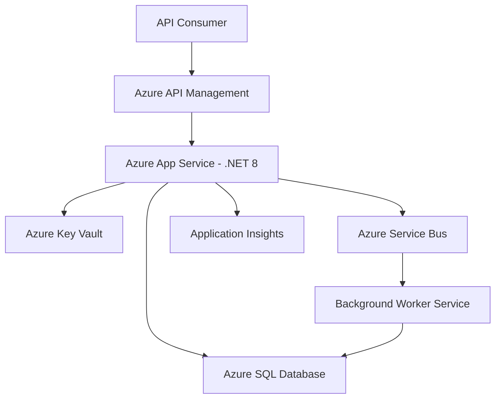

# Example: .NET API on Azure

> What the `.ai/` folder looks like for a .NET 8 Web API hosted on Azure App Service.

## Folder Layout

```
.ai/
├── .meta.yml
├── project-context.md
├── architecture.md
├── runbooks.md
├── dependencies.md
├── cms.md                    # May be minimal if no CMS
├── operational-context.md
├── coding-standards.md
├── agent-registry.md
└── onboarding.md
```

## Example `architecture.md` Snapshot



## Example `dependencies.md` Snapshot

| Dependency | Version | Type | Risk | Notes |
|-----------|---------|------|------|-------|
| .NET 8 | 8.0.x | Runtime | Medium | LTS until Nov 2026 |
| Entity Framework Core | 8.0.x | ORM | Low | Code-first migrations |
| Azure SQL | N/A | Platform | Low | Geo-replicated |
| Azure Service Bus | N/A | Platform | Medium | Message ordering enabled |
| MediatR | 12.x | Library | Low | CQRS pattern |
| FluentValidation | 11.x | Library | Low | Request validation |

## Example `runbooks.md` Snapshot

### Elevated 5xx on API

1. Check Application Insights → Failures blade → filter by time range
2. Look for dependency failures (SQL timeouts, Service Bus dead letters)
3. Check Azure App Service → Diagnose and Solve → Web App Down
4. If SQL: check DTU usage in Azure Portal → Scale up if >80%
5. If Service Bus: check dead letter queue → reprocess or investigate poison messages
6. Escalate to on-call if not resolved in 15 minutes

## Example `coding-standards.md` Snapshot

- **Architecture**: Clean Architecture (Domain → Application → Infrastructure → API)
- **API conventions**: RESTful, PascalCase for C# properties, camelCase in JSON (via System.Text.Json)
- **Error handling**: ProblemDetails (RFC 7807) for all error responses
- **Testing**: xUnit + FluentAssertions + NSubstitute, minimum 80% coverage on Application layer
- **Migrations**: EF Core code-first, migration per PR, no manual SQL
