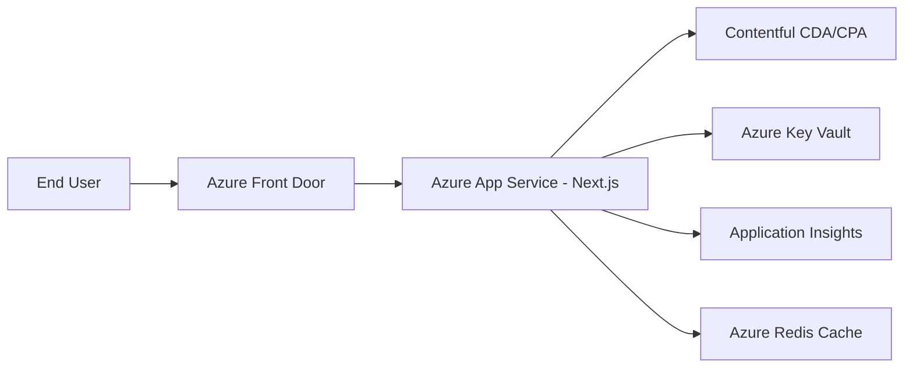

# Example Generated `.ai` Folder

Scenario: Next.js storefront hosted on Azure, using Contentful for content management.

## Folder Layout

```text
.ai/
  project-context.md
  architecture.md
  runbooks.md
  dependencies.md
  cms.md
  operational-context.md
  coding-standards.md
  agent-registry.md
  onboarding.md
```

## Example `architecture.md` Snapshot



Key notes:
- Next.js server-side rendering runs in Azure App Service.
- Contentful draft preview uses CPA tokens and preview subdomain.
- Secrets are retrieved from Key Vault via managed identity.
- Application Insights captures request traces and dependency calls.

## Example `dependencies.md` Snapshot

| Type | Dependency | Purpose | Risk |
|---|---|---|---|
| Runtime | `next@14` | Web app framework | Medium (major upgrade cadence) |
| Runtime | `contentful@10` | CMS integration | Medium (API contract drift) |
| Platform | Azure Front Door | Edge routing and WAF | Medium (routing config complexity) |
| Platform | Application Insights | Observability | Low |

## Example `runbooks.md` Snapshot

- **Incident: Elevated 5xx on storefront**
  1. Check Front Door health probe results.
  2. Validate latest App Service deployment in CI.
  3. Inspect Application Insights dependency failures to Contentful.
  4. Roll back to previous successful release if error rate > 5% for 10 min.

## Example `cms.md` Snapshot

- Space: `dept-storefront-prod`
- Environments: `master`, `staging`
- Webhooks:
  - publish -> cache purge endpoint `/api/revalidate`
  - unpublish -> targeted path purge
- Assumption: all content model migrations are executed via CI job `contentful:migrate`.
- Confidence: 78%

## Example `agent-registry.md` Snapshot

- Agent: Discovery Agent
  - Scope: repository read, `.ai` generation
  - Requires approval: merge to main
- Agent: Maintainer Agent
  - Scope: repository read, `.ai` targeted updates post-sprint or post-release
  - Requires approval: merge to main
- Agent: Incident Assistant
  - Scope: summarize alerts, propose runbook actions
  - Restricted: direct production command execution
