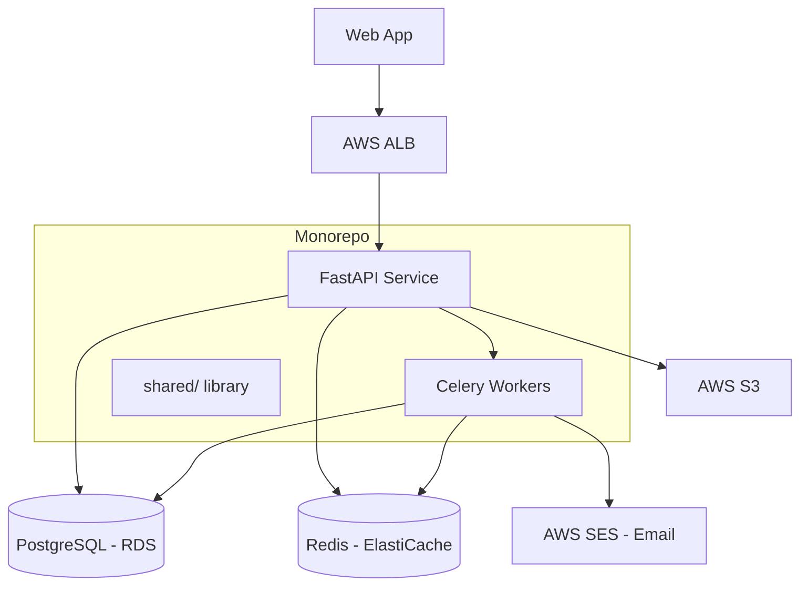

# Example: Python Monorepo (FastAPI + Workers)

> What the `.ai/` folder looks like for a Python monorepo with FastAPI services and Celery workers.

## Folder Layout

```
.ai/
├── .meta.yml
├── project-context.md
├── architecture.md
├── runbooks.md
├── dependencies.md
├── cms.md                    # Minimal — headless Strapi via API
├── operational-context.md
├── coding-standards.md
├── agent-registry.md
└── onboarding.md
```

## Example `architecture.md` Snapshot



## Example `dependencies.md` Snapshot

| Dependency | Version | Type | Risk | Notes |
|-----------|---------|------|------|-------|
| Python | 3.12.x | Runtime | Low | Managed via pyenv |
| FastAPI | 0.115.x | Framework | Low | Async, OpenAPI auto-docs |
| SQLAlchemy | 2.0.x | ORM | Low | Async sessions |
| Celery | 5.4.x | Task queue | Medium | Redis broker, flower monitoring |
| Alembic | 1.13.x | Migrations | Low | Auto-generate from models |
| Pydantic | 2.x | Validation | Low | Settings + request models |
| pytest | 8.x | Testing | Low | pytest-asyncio for async tests |

## Example `project-context.md` Snapshot

### Overview
- **Project**: Internal operations platform
- **Team**: 4 engineers, 1 tech lead
- **Client**: [CLIENT_NAME]
- **Contract type**: Managed Services — ongoing maintenance + feature work

### Environments
| Environment | URL | Branch | Deploy |
|------------|-----|--------|--------|
| Development | dev.internal.example.com | develop | Auto on push |
| Staging | staging.internal.example.com | main | Auto on merge |
| Production | app.example.com | main | Manual approval |

### Monorepo Structure
```
├── services/
│   ├── api/          # FastAPI service
│   └── workers/      # Celery workers
├── shared/           # Shared models, utils
├── migrations/       # Alembic migrations
├── tests/            # Shared test fixtures
├── docker-compose.yml
└── pyproject.toml    # Root project config
```

## Example `coding-standards.md` Snapshot

- **Style**: Ruff for linting + formatting (replaces black + isort + flake8)
- **Type checking**: mypy strict mode on shared/ and services/
- **Testing**: pytest + pytest-asyncio + factory_boy, 85% coverage target
- **API conventions**: RESTful, snake_case everywhere, Pydantic v2 models
- **Git workflow**: Feature branches → PR → squash merge to main
- **Dependencies**: uv for package management, pinned in pyproject.toml
